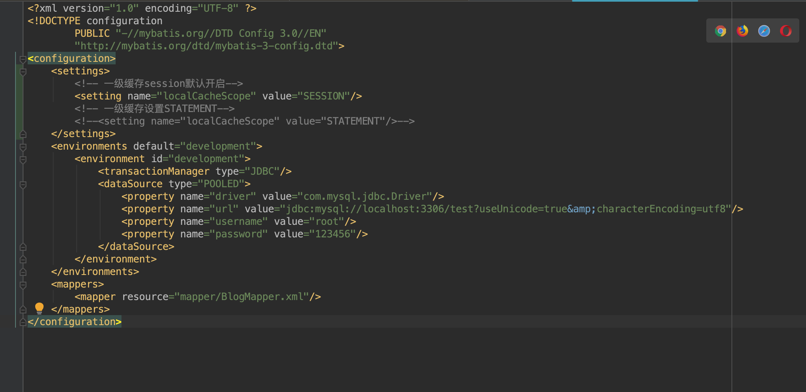
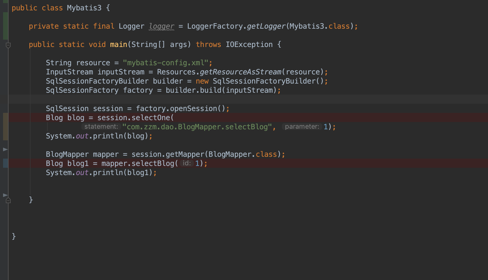
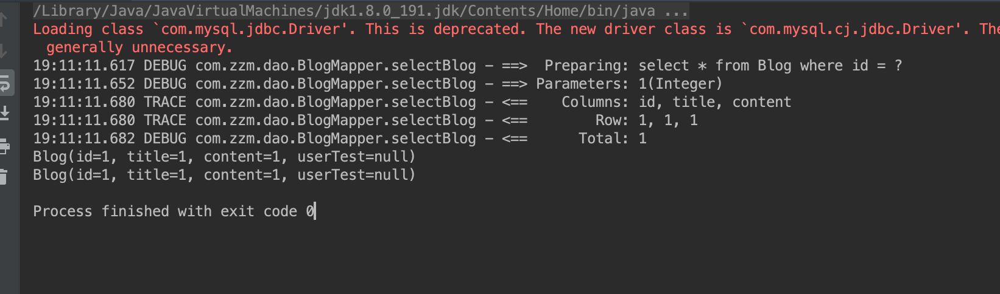

# mybatis源码之二  缓存


#

## 1：一级缓存设置

###1.1:mybatis-config文件配置




### 1.2: 测试代码



###1.3:测试结果



代码执行两个相同查询语句,mybatis日志打印一次,第二次查询走了缓存。

## 2：从源码分析同一个session如何走缓存，分析如下

```java
session.selectOne(…………) ->
	org.apache.ibatis.session.defaults.DefaultSqlSession#selectOne(…………)->
	 ………………
	 org.apache.ibatis.session.defaults.DefaultSqlSession#selectList(………………)->
	  ……………………
  public <E> List<E> query(…………) throws SQLException {
    BoundSql boundSql = ms.getBoundSql(parameterObject);
    //生成缓存key
    CacheKey key = createCacheKey(ms, parameterObject, rowBounds, boundSql);
    return query(ms, parameterObject, rowBounds, resultHandler, key, boundSql);
  } 
```

继续执行下面方法生成缓存key，

key规则=ms.getId()+rowBounds.getOffset()+rowBounds.getLimit()+boundSql.getSql()

```java
org.apache.ibatis.executor.BaseExecutor#createCacheKey(MappedStatement ms, Object parameterObject, RowBounds rowBounds, BoundSql boundSql) {
    if (closed) {
      throw new ExecutorException("Executor was closed.");
    }
    CacheKey cacheKey = new CacheKey();
    cacheKey.update(ms.getId());
    cacheKey.update(rowBounds.getOffset());
    cacheKey.update(rowBounds.getLimit());
    cacheKey.update(boundSql.getSql());
   ………………
    return cacheKey;
  }
```


```java

   继续执行以下方法
    org.apache.ibatis.executor.CachingExecutor#query(…………){
	//从缓存执行语句中获取
	Cache cache = ms.getCache();
	  //获取到缓存从缓存获取
    if (cache != null) {
      flushCacheIfRequired(ms);
      if (ms.isUseCache() && resultHandler == null) {
        ensureNoOutParams(ms, boundSql);
        @SuppressWarnings("unchecked")
        List<E> list = (List<E>) tcm.getObject(cache, key);
        if (list == null) {
          list = delegate.query(………………);
          tcm.putObject(cache, key, list); // issue #578 and #116
        }
        return list;
      }
    }
    //缓存中没有 执行以下方法 该方法真正执行sql 并打印语句
    return delegate.query(ms, parameterObject, rowBounds, resultHandler, key, boundSql);
  }	 
  
  
```

继续执行以下方法 查询数据

```java

  org.apache.ibatis.executor.BaseExecutor#query(……………………) {
  …………………………
    List<E> list;
    try {
      queryStack++;
      //从缓存中获取
      list = resultHandler == null ? (List<E>) localCache.getObject(key) : null;
      if (list != null) {
        handleLocallyCachedOutputParameters(ms, key, parameter, boundSql);
      } else {
        //为空执行sql
        list = queryFromDatabase(ms, parameter, rowBounds, resultHandler, key, boundSql);
      }
    } finally {
      queryStack--;
    }
    ……………………
      //如果一级缓存设置STATEMENT 清除缓存每次都是重新执行查询
      if (configuration.getLocalCacheScope() == LocalCacheScope.STATEMENT) {
        // issue #482
        clearLocalCache();
      }
    }
    return list;
  }
   
```

继续执行以下方法：把数据保存在缓存中

```java
org.apache.ibatis.executor.BaseExecutor#queryFromDatabase(………………){
    List<E> list;
    localCache.putObject(key, EXECUTION_PLACEHOLDER);
    try {
      //获取数据 
      list = doQuery(ms, parameter, rowBounds, resultHandler, boundSql);
    } finally {
      //清空缓存
      localCache.removeObject(key);
    }
  	//设置缓存
    localCache.putObject(key, list);
    if (ms.getStatementType() == StatementType.CALLABLE) {
      localOutputParameterCache.putObject(key, parameter);
    }
    return list;
  }
```

## 3：session提交可以清除缓存


执行commit，执行相同参数查询，打印出两条日志,从代码里面查看是把缓存清空，代码比较简单，可以自行跟踪。

## 4：查看一级缓存默认配置源码

```java
org.apache.ibatis.builder.xml.XMLConfigBuilder#settingsElement(…………){
    …………………………
     //一级缓存默认是true 开启
    configuration.setCacheEnabled(booleanValueOf(props.getProperty("cacheEnabled"), true));
    ………………
//一级缓存默认是session级别     
      configuration.setLocalCacheScope(LocalCacheScope.valueOf(props.getProperty("localCacheScope", "SESSION")));
     ………………
  }

```


## 5：总结

mybatis有一级和二级缓存，一级缓存默认开启，二级缓存默认关闭不推荐使用,一级缓存默认开启会话级别，也可以设置STATEMENT级别，如果设置STATEMENT同一个session每次查询不会缓存，都是直接执行sql

[源码地址](https://github.com/knowledgeAlan/mybatis-demo)


## 一级缓存默认是开启，是session级别，是关闭不了，可以配置localCacheScope=STATEMENT范围

```java
org.apache.ibatis.builder.xml.XMLConfigBuilder#settingsElement(){
  ………………
      configuration.setCacheEnabled(booleanValueOf(props.getProperty("cacheEnabled"), true));
…………
}
```


```java
org.apache.ibatis.executor.BaseExecutor#query(org.apache.ibatis.mapping.MappedStatement, java.lang.Object, org.apache.ibatis.session.RowBounds, org.apache.ibatis.session.ResultHandler, org.apache.ibatis.cache.CacheKey, org.apache.ibatis.mapping.BoundSql){
    ……………………
     // issue #601
      deferredLoads.clear();
      if (configuration.getLocalCacheScope() == LocalCacheScope.STATEMENT) {
        // issue #482
        清除一级缓存
        clearLocalCache();
      }
}
```

